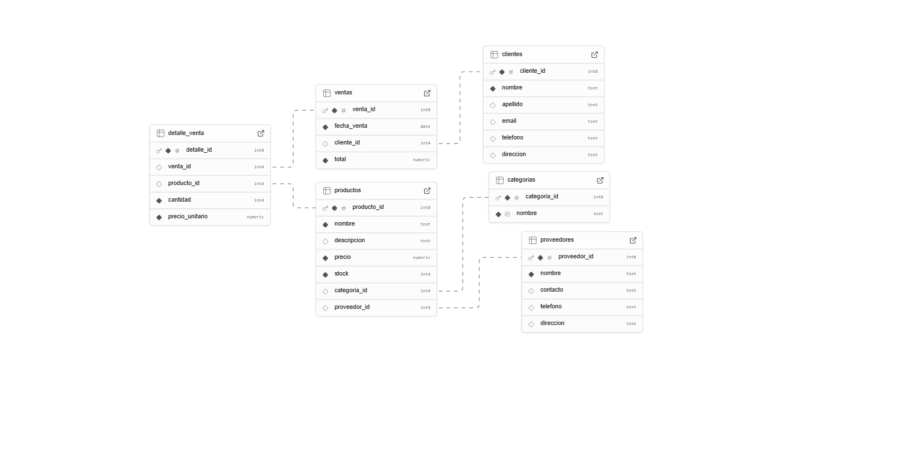

# Inventario y Ventas para una Tienda

###### Integrantes
* 17 Izabella Pérez
* 10 Doris Padilla 
* 23 María Gonzales
* 42 Enrique Mejía
* 49 Jafet Mejía
* 52 Juan Ramírez

###### 11° BTP INFORMATICA  -  Profe German Solorzano

Se basa en un sitema para controlar el stock de productos, los proveedores y las ventas a los clientes.

### Sus entidades principales son:
+ Productos
+ Categorias
+ Ventas
+ clientes
+ Proveedores

###### 22 de agosto del 2025